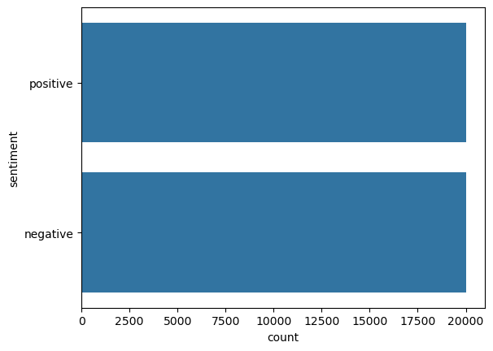

# Data Science

## Introduction

**This README section is the shortened version of `main.ipynb` notebook. It's still contains all the main information, but for more full and detailed comments on topics, please, refer to notebook file in `notebooks` folder.**

This project works with dataset for binary sentiment classification. It provides a set of 50,000 polar movie reviews for training and testing.

Firstly, downlodd and import everything that will be used

## EDA

Check for imbalance:



Dataset is perfectly balanced

## Feature engineering

### Data cleaning

As a first step, i will remove any redundant characters, that doesnt provide any value for sentiment analysis:

```
def clean_text(text):
    text = re.sub(r'\W', ' ', str(text))  # Remove special characters
    text = re.sub(r'\s+[a-zA-Z]\s+', ' ', text)  # Remove single characters
    text = re.sub(r'\^[a-zA-Z]\s+', ' ', text)  # Remove single characters from start
    text = re.sub(r'\s+', ' ', text, flags=re.I)  # Replace multiple spaces with single space
    text = re.sub(r'^b\s+', '', text)  # Remove prefixed 'b'
    text = text.lower()
    return text
```

# MLE

## Train

`docker build -f ./src/train/Dockerfile -t sentiment-analysis .` — build image

`docker run --rm -v ${PWD}/outputs/models:/app/outputs/models sentiment-analysis` — run container. Saved at `outputs/models`

## Inference
